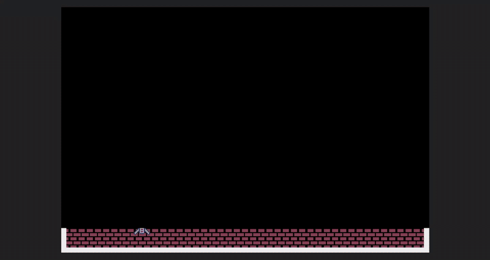
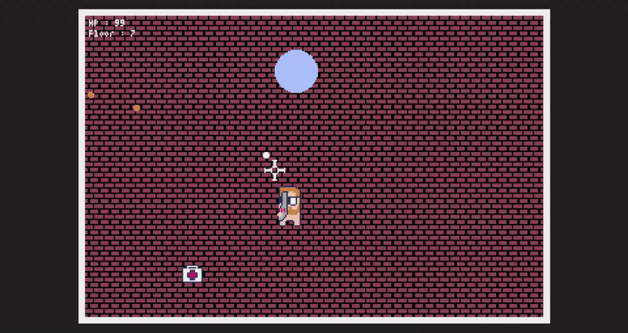
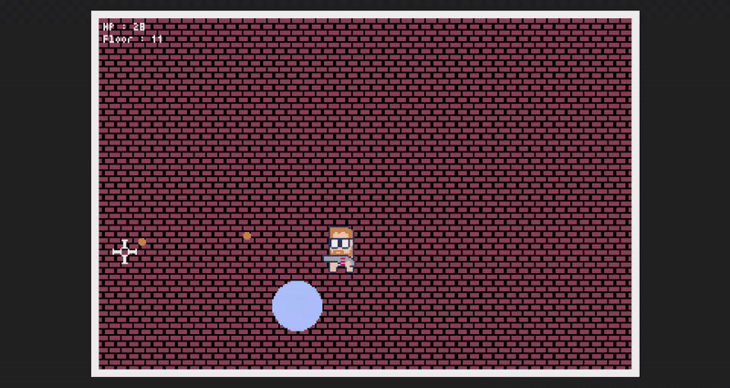

# T.O.W.E.R

Jeu de survie shooter pixelisé en 2D

Il s'agit de terminer le plus grand nombre de niveaux, qui sont à difficulté croissante.
Pour chaque niveau, il y a un kit de soin pour récupérer des PV, et un portail pour accéder au niveau suivant

### Eliminez tout les ennemis

### Passez à l'étage suivant

### Avant le game over

## ARBORESCENCE DU PROJET
  
|_ app.py  
|_ sources  
|   |_ res.pyxres  
|_ doc  
|   |_ guide.txt  
|_ README.md  
|_ requirements.txt  

## Démarrage

- Requis : python 3 ainsi que la bibliothèque pyxel
- Exécuter app.py pour démarrer le jeu (`python3 app.py` ou lancer avec un IDE)

## Utilisation

Z : se déplacer vers le haut
Q : se déplacer vers la gauche
S : se déplacer vers le bas
D : se déplacer vers la droite

A : passer à l'arme précédente
E : passer à l'arme suivante

Space : prendre un portail

LeftClick : tirer

Echap : quitter le jeu

Utilisation d'une souris recommandée
